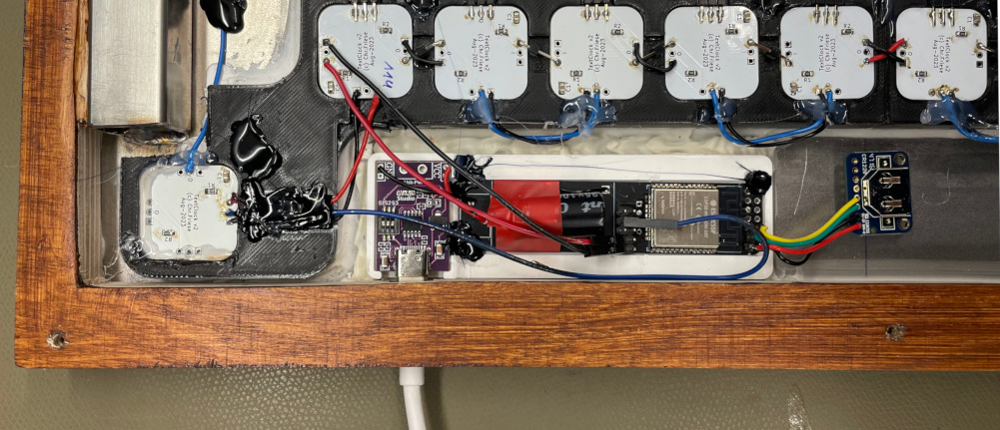
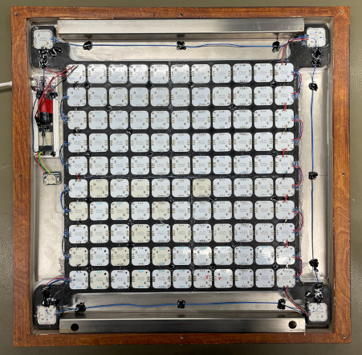
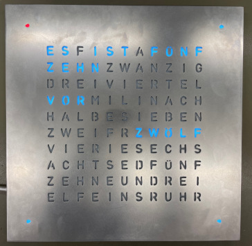

# Time expressed by words

## Introduction

The concept of presenting the current time by individual words is not new and demonstrated quite often e.g. on Youtube. Out of curiousity this private project was started without considering too much input from other sources. The goal was to prepare one working demonstrator. 

## Basic setup

The principle setup consist of a front plate with cut-outs for the indiviual letters, an illumnination electronic behind each letter and a control circuit to control the individual LEDs.

### Front plate
For the front plate a suitbale svg template was created with Inkscape. All together over 100 letters are required. The file was then transferred with laser cutting into a steel plate. To have a stable, non bending plate, 2mm steel was choosen.

*Lessons learned: this is (too) heavy, thinner would be acceptable.*

### Electronics
To generate a uniform illumniation behind each letter, two RGBW LEDs (SK6812) were considered for each letter. This sums up to a total of over 200 LEDs that needed to be driven and powered in a row. They are mounted on individual small PCBs as this approach seemed more cost efficient than having a huge PCB behind the entire front plate. 

*Lessons learned: lot of soldering between the PCBs needed.*

### Control units
An ESP32 based setup was choosen to drive the LEDs. A simple look-up table is used to translate the current time into a definition of which LED to switch on/off. The time is retrieved by NTP which turned out to be not reliable enough. Adding a RTC to the setup solved the challenge. The power is supplied by a USB-C connection providing sufficient power. To control the behavior (color & intensity) of the clock, a simple async server was setup on the ESP. 

*Lessons learned: do not rely on Wifi, use RTC as backup.*

### Assembly
For aligning the PCBs to the letters a 3D printed frame was used. This frame also prevents cross-talk of the illumnation between the different elements. To hide the LEDs from the frontside, the frame was partially filled with epoxy. White pigments were added to the epoxy. Unfortunately this lead to a color shift of the LEDs and less defined appearance. To hide all the installation, hot glue and flying wires a wooden backplate was attached to the setup.

*Lessons learned: "white" epoxy screws up color fidelity.*

## Conclusion
The demonstrator works and looks nice. I used and combined a couple of new technologies (for myself) and learned a lot for future projects. After considering all the effort (material, hours), it seems more reasonable, why a commercial product is expensive.

